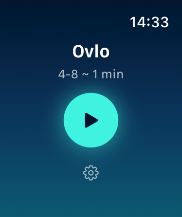
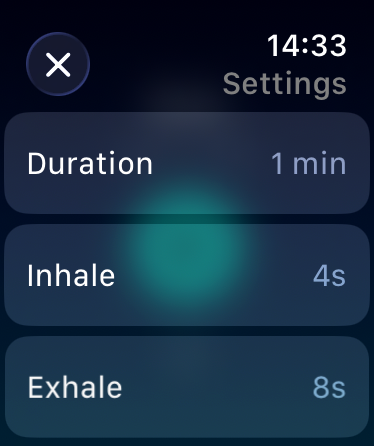
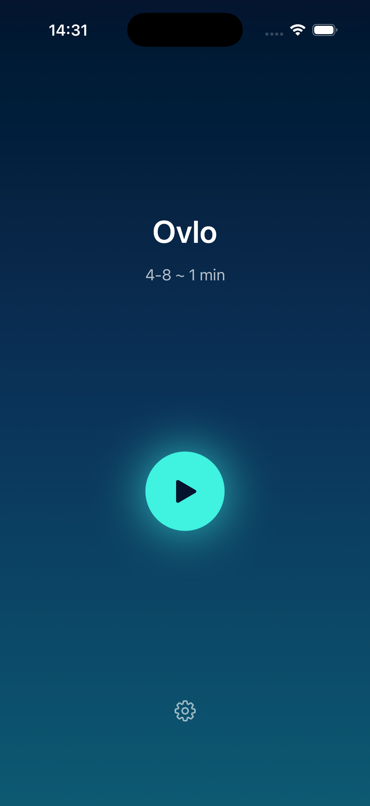
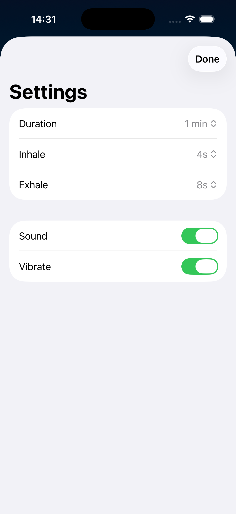
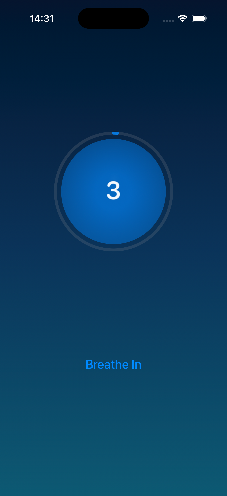
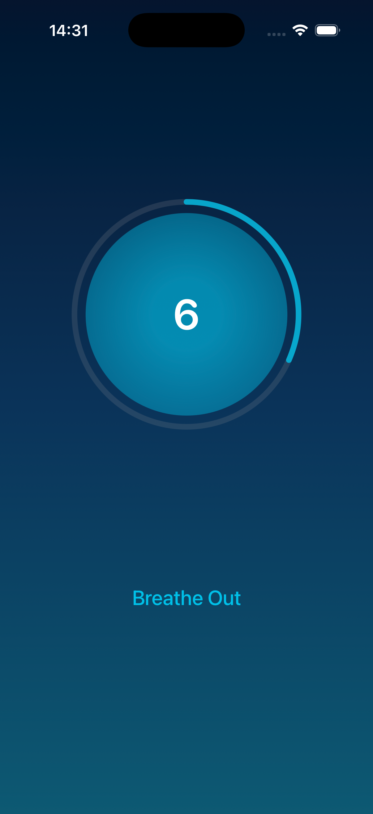

# Ovlo

Find calm.

## Features

- **Guided breathing exercises** - Smooth animated circle that expands and contracts to guide your breathing rhythm
- **Customizable timing** - Adjust inhale and exhale durations (4-12s each) and session length (1-15 min)
- **Sound & haptic feedback** - Optional chime and vibration mark each breath transition (toggleable in settings)
- **Progress tracking** - Visual progress ring shows session completion with countdown timer
- **Screen stays active** - Display remains on during sessions (always-on mode on Apple Watch)

## In Action

<table align="center">
  <tr>
    <td align="center" valign="middle"></td>
    <td align="center" valign="middle"></td>
  </tr>
</table>

## Screenshots

### Watch App

<table align="center">
  <tr>
    <td align="center"></td>
    <td align="center"></td>
  </tr>
  <tr>
    <td align="center"></td>
    <td align="center"></td>
  </tr>
</table>

### iOS App

<table align="center">
  <tr>
    <td align="center"></td>
    <td align="center"></td>
  </tr>
  <tr>
    <td align="center"></td>
    <td align="center"></td>
  </tr>
</table>

## Installation

1. Clone the repository
2. Open `Ovlo.xcodeproj` in Xcode
3. Select your device as the destination
4. Build and run

## Usage

1. Open Ovlo on your watch or iPhone
2. Tap the settings cog to adjust duration, breath timing, and sound/vibrate preferences
3. Tap the play button to start
4. Follow the expanding/contracting circle - inhale as it grows, exhale as it shrinks
5. Swipe up to complete early, or wait for the session to finish
6. Tap "Done" to return to the start screen

## Requirements

- iOS 18.6 or later
- watchOS 11.6 or later

## License

This project is licensed under the MIT License - see the [LICENSE](LICENSE) file for details.
