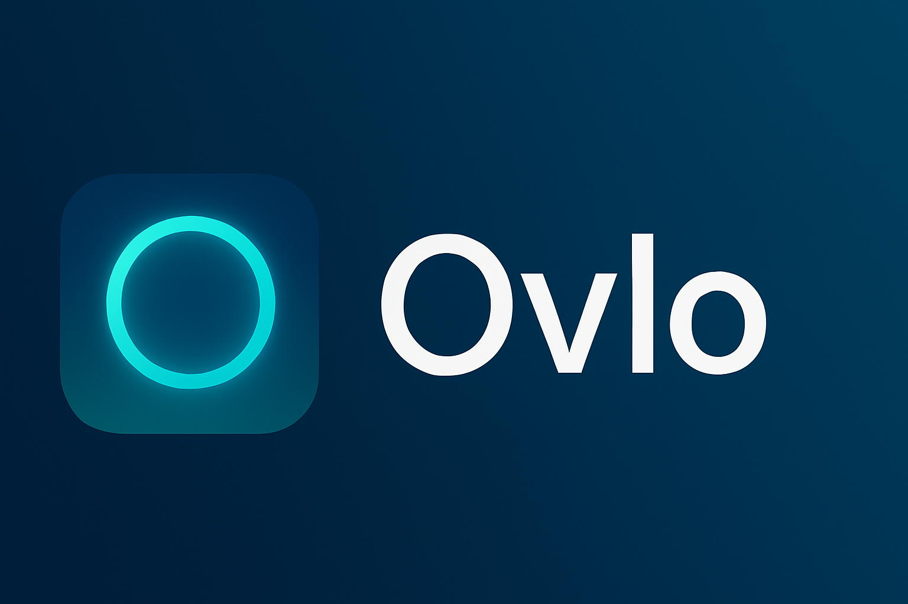
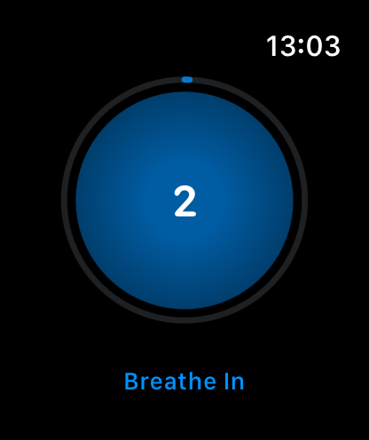
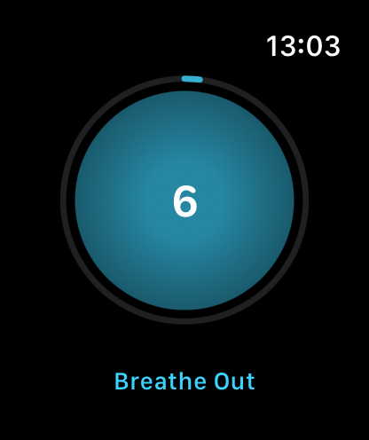

# Ovlo

Find calm.

## Features

- **Guided breathing exercises** - Smooth animated circle that expands and contracts to guide your breathing rhythm
- **Customizable timing** - Adjust inhale and exhale durations (4-12s each) and session length (1-15 min)
- **Haptic feedback** - Gentle haptics on Apple Watch mark each breath transition
- **Progress tracking** - Visual progress ring shows session completion with countdown timer
- **Dual-device control** - Start sessions directly on your watch or remotely from your iPhone

## In Action

  

## Screenshots

### Watch App

  
  
  

### iOS Companion App

  
  

## Installation

1. Download the latest release
2. Open `Ovlo.xcodeproj` in Xcode
3. Select your Apple Watch as the destination
4. Build and run

## Usage

### On Apple Watch

1. Open Ovlo on your watch
2. Tap the settings cog to adjust duration and breath timing
3. Tap the play button to start
4. Follow the expanding/contracting circle - inhale as it grows, exhale as it shrinks
5. Swipe up to complete early, or wait for the session to finish
6. Tap "Done" to return to the start screen

### From iPhone

1. Open the Ovlo companion app
2. Ensure your watch is connected (green indicator)
3. Adjust settings using the gear icon
4. Tap play to start a session on your watch
5. Tap stop to end the session remotely

## Requirements

- iOS 26.0 or later
- watchOS 26.0 or later
- Apple Watch paired with iPhone

## License

This project is licensed under the MIT License - see the [LICENSE](LICENSE) file for details.
