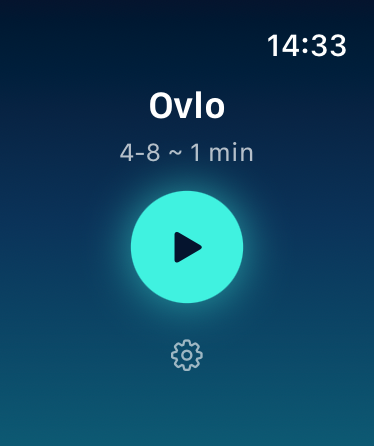
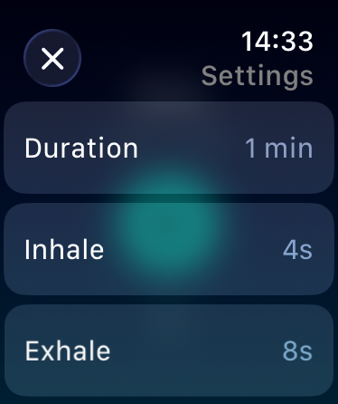
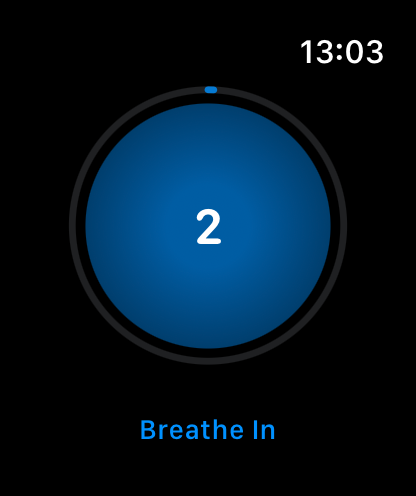
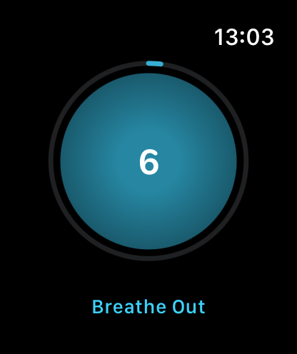
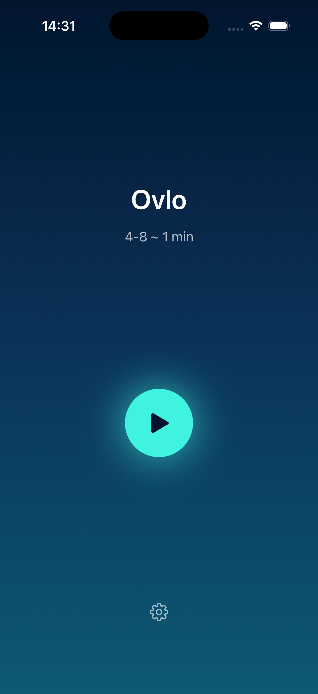
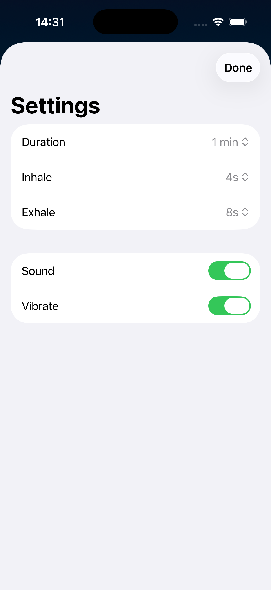
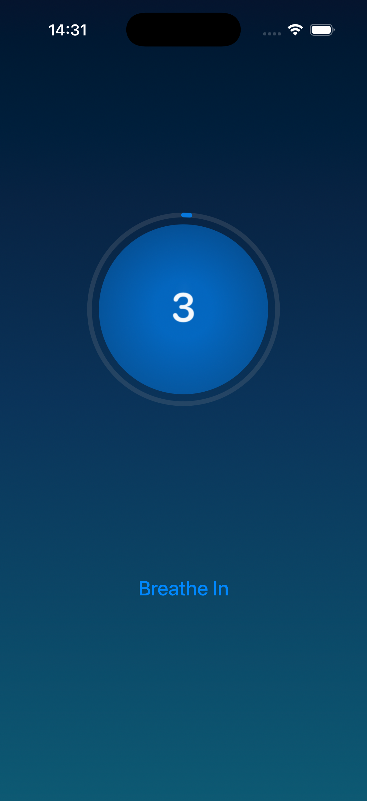
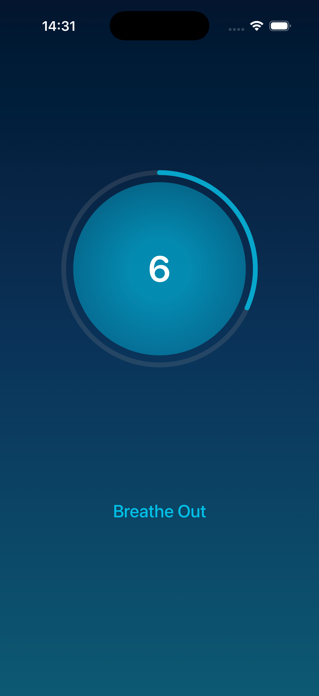

# Ovlo

Find calm.

## Features

### iOS
- **Breathe** - Animated circle guides inhale/exhale with optional music and affirmations
- **Guided** - Play meditation audio with progress tracking
- **Music** - Timed ambient music with optional affirmations
- Add your own chimes, music, and meditations (see [Custom Audio](#custom-audio))
- Import audio from Files or Apple Music
- Haptic feedback on breath transitions

### watchOS
- Guided breathing with same customization as iOS
- Background sessions continue with wrist lowered
- Always-on display support
- Chimes and haptic feedback

## In Action

<table align="center">
  <tr>
    <td align="center" valign="middle"></td>
    <td align="center" valign="middle"></td>
  </tr>
</table>

## Screenshots

### Watch App

<table align="center">
  <tr>
    <td align="center"></td>
    <td align="center"></td>
  </tr>
  <tr>
    <td align="center"></td>
    <td align="center"></td>
  </tr>
</table>

### iOS App

<table align="center">
  <tr>
    <td align="center"></td>
    <td align="center"></td>
  </tr>
  <tr>
    <td align="center"></td>
    <td align="center"></td>
  </tr>
</table>

## Installation

1. Clone the repository
2. Open `Ovlo.xcodeproj` in Xcode
3. Add audio files (see [Custom Audio](#custom-audio))
4. Select your device as the destination
5. Build and run

## Usage

### iOS

1. Open Ovlo on your iPhone
2. Select a session type: **Breathe**, **Guided**, or **Music**
3. Tap the settings cog to adjust preferences for the selected mode
4. Tap the play button to start
5. For breathing sessions, follow the expanding/contracting circle
6. Swipe up to complete early, or wait for the session to finish

### watchOS

1. Open Ovlo on your Apple Watch
2. Tap the settings cog to adjust duration, breath timing, and sound/vibrate preferences
3. Tap the play button to start
4. Follow the expanding/contracting circle - inhale as it grows, exhale as it shrinks
5. Swipe up to complete early, or wait for the session to finish

## Custom Audio

Audio files are not included in the repository. To add your own:

### iOS Audio

**Chimes** (`OvloPhone/Resources/Chimes/`):
1. Add your audio file (e.g., `my-chime.mp3`)
2. Add entry to `chimes.json`: `{"id": "my-chime", "title": "My Chime"}`

**Music tracks** (`OvloPhone/Resources/Music/`):
1. Add your audio file (e.g., `peaceful-piano.mp3`)
2. Add entry to `music.json`: `{"id": "peaceful-piano", "title": "Peaceful Piano"}`

**Guided meditations** (`OvloPhone/Resources/Meditations/`):
1. Add your audio file (e.g., `body-scan.mp3`)
2. Add entry to `meditations.json`: `{"id": "body-scan", "title": "Body Scan"}`

### watchOS Audio

**Chimes** (`OvloWatch/Resources/Chimes/`):
- Same pattern as iOS chimes

### Notes

- The `id` must match the filename (without extension)
- Supported formats: `.mp3`, `.wav`, `.m4a`, `.aiff`, `.caf`
- First entry in each JSON file is the default selection
- You can also import audio from the Files app or Apple Music library within the iOS app

## Requirements

- iOS 18.6 or later
- watchOS 11.6 or later

## License

This project is licensed under the MIT License - see the [LICENSE](LICENSE) file for details.
