# Ovlo

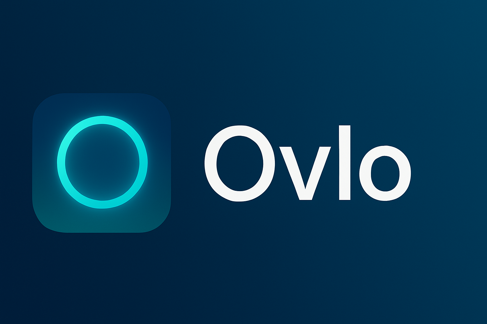

Find calm.

## Features

### iOS

Three session types to suit your practice:

- **Breathe** - Animated breathing circle guides inhale/exhale with customizable timing, optional background music, and affirmations
- **Guided** - Play meditation audio with circular progress tracking (bundled meditations or import your own)
- **Music** - Timed ambient music sessions with optional affirmations

Additional features:

- Customizable chimes, music, and meditations (see [Custom Audio](#custom-audio))
- Import audio from Files app or Apple Music library
- Haptic feedback on breath transitions
- Personalize affirmations with your own messages

### watchOS

- Guided breathing with animated circle
- Customizable session duration and breath timing
- Background sessions continue with wrist lowered
- Always-on display support
- Optional chimes and haptic feedback

## Screenshots

### iOS App

#### Breathe Mode

<table align="center">
  <tr>
    <td align="center">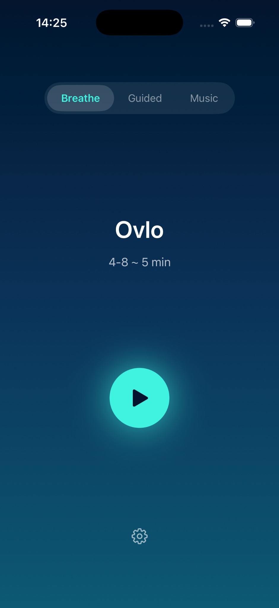</td>
    <td align="center">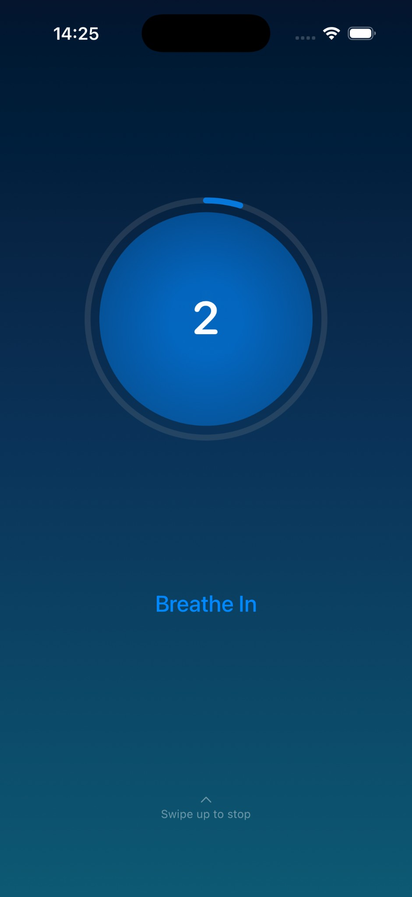</td>
    <td align="center">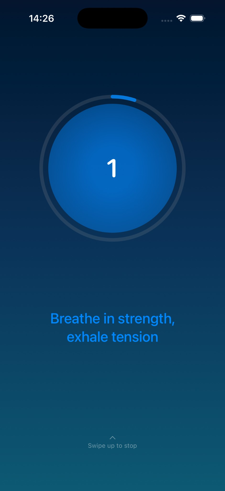</td>
    <td align="center">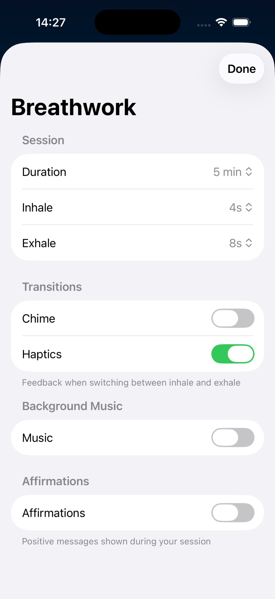</td>
  </tr>
  <tr>
    <td align="center"><em>Start</em></td>
    <td align="center"><em>Breathing</em></td>
    <td align="center"><em>With Affirmation</em></td>
    <td align="center"><em>Settings</em></td>
  </tr>
</table>

#### Guided Mode

<table align="center">
  <tr>
    <td align="center">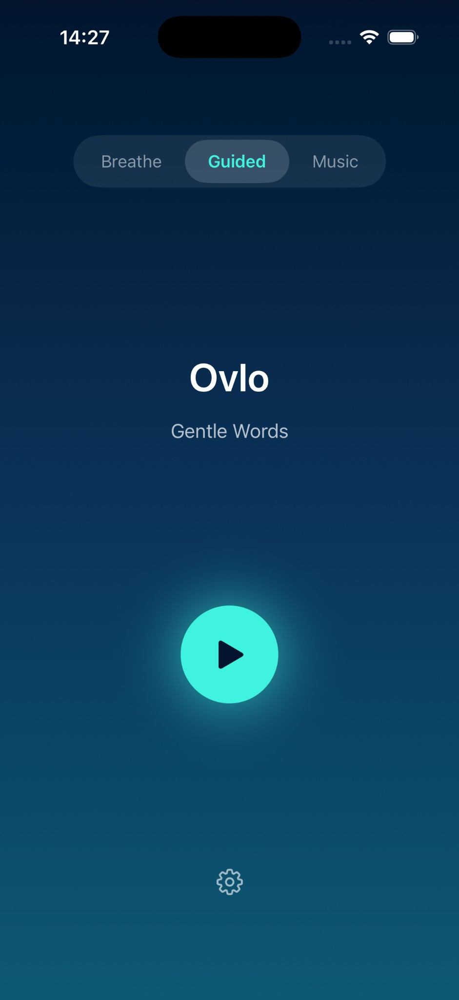</td>
    <td align="center">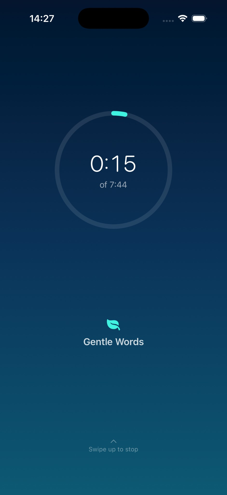</td>
    <td align="center">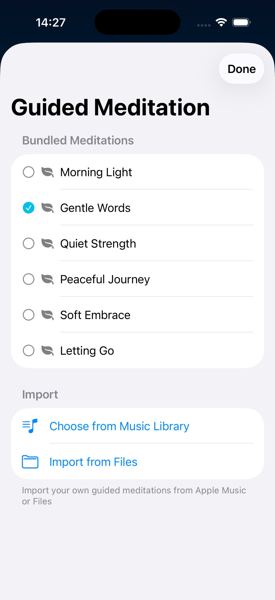</td>
  </tr>
  <tr>
    <td align="center"><em>Start</em></td>
    <td align="center"><em>Session</em></td>
    <td align="center"><em>Settings</em></td>
  </tr>
</table>

#### Music Mode

<table align="center">
  <tr>
    <td align="center">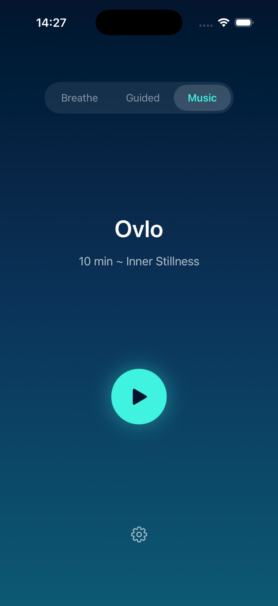</td>
    <td align="center">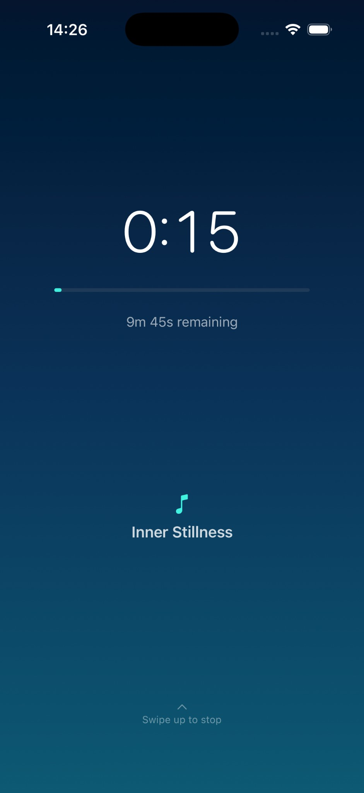</td>
    <td align="center">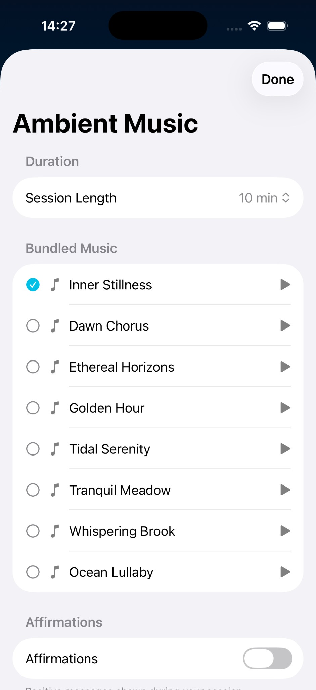</td>
  </tr>
  <tr>
    <td align="center"><em>Start</em></td>
    <td align="center"><em>Session</em></td>
    <td align="center"><em>Settings</em></td>
  </tr>
</table>

#### Affirmations

<table align="center">
  <tr>
    <td align="center">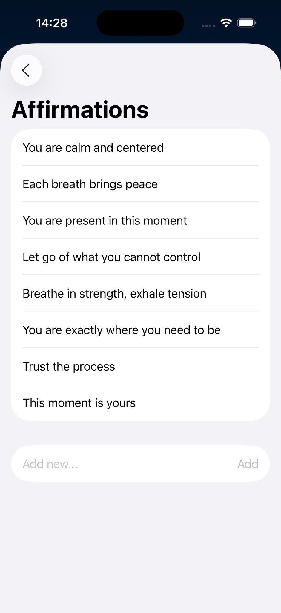</td>
  </tr>
  <tr>
    <td align="center"><em>Customize your affirmations</em></td>
  </tr>
</table>

### Watch App

<table align="center">
  <tr>
    <td align="center">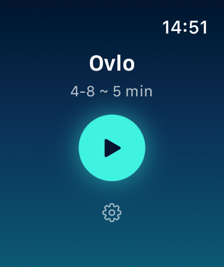</td>
    <td align="center">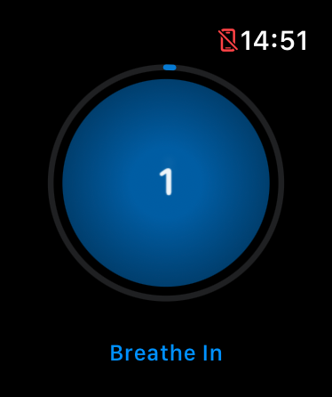</td>
    <td align="center">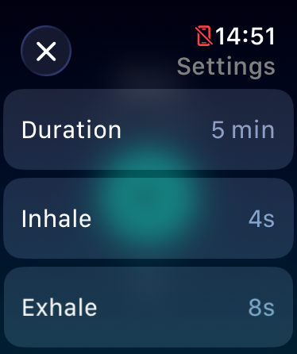</td>
  </tr>
  <tr>
    <td align="center"><em>Start</em></td>
    <td align="center"><em>Breathing</em></td>
    <td align="center"><em>Settings</em></td>
  </tr>
</table>

## Installation

1. Clone the repository
2. Open `Ovlo.xcodeproj` in Xcode
3. Add audio files (see [Custom Audio](#custom-audio))
4. Select your device as the destination
5. Build and run

## Usage

### iOS

1. Open Ovlo on your iPhone
2. Select a session type: **Breathe**, **Guided**, or **Music**
3. Tap the settings cog to adjust preferences for the selected mode
4. Tap the play button to start
5. For breathing sessions, follow the expanding/contracting circle
6. Swipe up to complete early, or wait for the session to finish

### watchOS

1. Open Ovlo on your Apple Watch
2. Tap the settings cog to adjust duration, breath timing, and sound/vibrate preferences
3. Tap the play button to start
4. Follow the expanding/contracting circle - inhale as it grows, exhale as it shrinks
5. Swipe up to complete early, or wait for the session to finish

## Custom Audio

Audio files are not included in the repository. To add your own:

### iOS Audio

**Chimes** (`OvloPhone/Resources/Chimes/`):

1. Add your audio file (e.g., `my-chime.mp3`)
2. Add entry to `chimes.json`: `{"id": "my-chime", "title": "My Chime"}`

**Music tracks** (`OvloPhone/Resources/Music/`):

1. Add your audio file (e.g., `peaceful-piano.mp3`)
2. Add entry to `music.json`: `{"id": "peaceful-piano", "title": "Peaceful Piano"}`

**Guided meditations** (`OvloPhone/Resources/Meditations/`):

1. Add your audio file (e.g., `body-scan.mp3`)
2. Add entry to `meditations.json`: `{"id": "body-scan", "title": "Body Scan"}`

### watchOS Audio

**Chimes** (`OvloWatch/Resources/Chimes/`):

- Same pattern as iOS chimes

### Notes

- The `id` must match the filename (without extension)
- Supported formats: `.mp3`, `.wav`, `.m4a`, `.aiff`, `.caf`
- First entry in each JSON file is the default selection
- You can also import audio from the Files app or Apple Music library within the iOS app

## Requirements

- iOS 18.6 or later
- watchOS 11.6 or later

## License

This project is licensed under the MIT License - see the [LICENSE](LICENSE) file for details.
